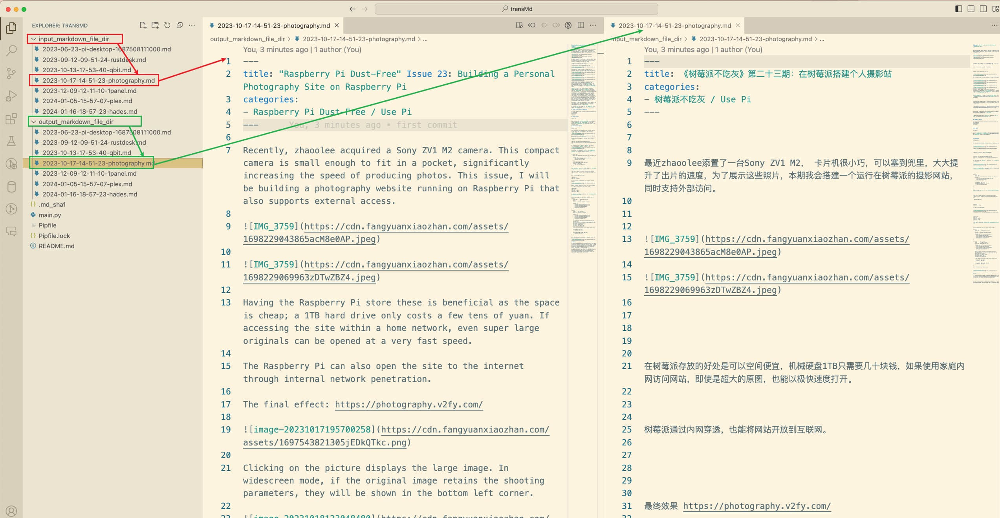

# 使用OpenAI ChatGPT批量将中文Markdown翻译为英文的工具

一个自用可以实现内容出海的，使用OpenAI ChatGPT批量将中文Markdown翻译为英文的工具。

翻译完成的效果展示: https://medium.com/@zhaoolee

## 使用方法

1. 将markdown简体中文文件批量放入 `input_markdown_file_dir`

2. 设置环境变量 `export OPENAI_API_KEY='sk-y********************W'`, 如果感觉费事，可以像我一样，直接写到`~/.zshrc`中

3. 进入transMd文件夹, 进入虚拟环境`pipenv shell`, 安装包`pipenv install`,运行 `python main.py`

3. 等一会儿, 翻译完成的markdown文件将会输出在 `output_markdown_file_dir`

## 工具特色

- 可以批量翻译markdown文件, 翻译完成的内容配合开源工具 `https://github.com/fanderzon/markdown-to-medium-tool` 可以发到Medium, 实现内容出海。

- 自动记录进度，如果有100篇markdown文件待翻译，翻译到第50篇断了，再次运行`python main.py`, 可以根据.md_sha1中记录的信息，自动从第50篇进行翻译，节约token

- `input_markdown_file_dir`中记录的markdown文件修改后，运行`python main.py`, 会只翻译修改后的markdown文件, 节约token

- 在main.py顶部变量, 可以自定义输入和输出文件夹

## 关于Prompt

Prompt来自 `https://github.com/smikitky/chatgpt-md-translator/blob/main/prompt-example.md` 

大多数Markdown的格式的翻译都很完美，也会会出现省略超长代码段的问题，如果有更好的prompt，我会更新。